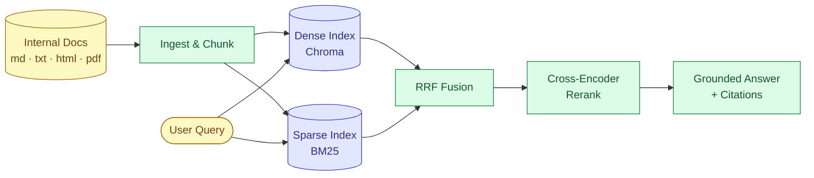
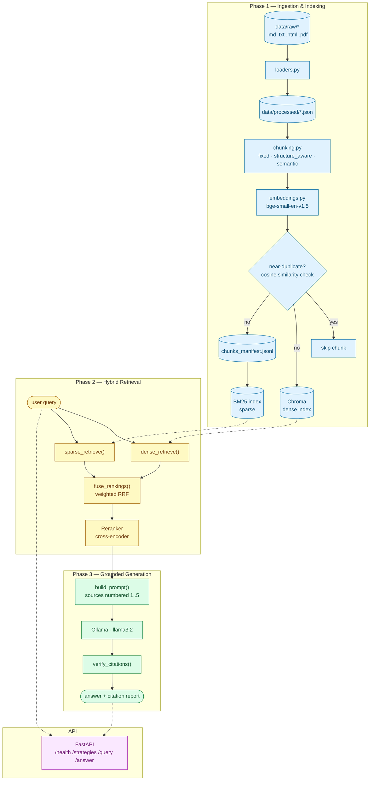

<div align="center">

# Ragforge — Hybrid Search RAG Pipeline

**A production-style Retrieval-Augmented Generation system**: multi-format ingestion, three
switchable chunking strategies, dense + sparse hybrid retrieval with RRF fusion and
cross-encoder reranking, and grounded answer generation with automated citation verification.

Runs **entirely free and local** — no API keys required for any phase.


</div>



<div align="center"><sub>Full breakdown with every module in the <a href="#architecture">Architecture</a> section below.</sub></div>

---

## Table of Contents

- [Highlights](#highlights)
- [Tech Stack](#tech-stack)
- [Architecture](#architecture)
- [Quickstart](#quickstart)
- [Verified End-to-End](#verified-end-to-end)
- [Usage](#usage)
  - [1. Generate sample docs](#1-generate-sample-docs-optional)
  - [2. Ingest](#2-ingest)
  - [3. Inspect / verify an index](#3-inspect--verify-an-index)
  - [4. Query — hybrid retrieval](#4-query--hybrid-retrieval)
  - [5. Answer — grounded generation](#5-answer--grounded-generation)
  - [6. API](#6-api)
  - [7. Docker](#7-docker)
- [Configuration Reference](#configuration-reference)
- [Project Structure](#project-structure)
- [Module Reference](#module-reference)
- [Design Decisions](#design-decisions)
- [Known Limitations](#known-limitations)

---

## Highlights

- **Multi-format ingestion** — Markdown, plain text, HTML, and PDF all normalize into a
  single `Document`/`Section` shape, with a processed-JSON cache so re-indexing never
  requires re-uploading source files.
- **Three chunking strategies, built side by side** — fixed-size baseline, structure-aware
  (anchored to section headings), and semantic (embedding-similarity sentence grouping) —
  each gets its own isolated index so they can be directly compared.
- **Hybrid retrieval** — dense (Chroma, cosine similarity) + sparse (BM25 keyword) fused
  with configurable-weight Reciprocal Rank Fusion, then narrowed by a cross-encoder
  reranker for a sharp precision boost on the final answer set.
- **Cosine-similarity dedup** — near-duplicate chunks (paragraphs copy-pasted across docs)
  are caught and skipped before they ever reach the index, keeping retrieval slots from
  being wasted on redundant content.
- **Grounded generation with citation verification** — every answer is generated with
  inline `[n]` citations back to its source chunk, then automatically checked for invented
  source numbers, uncited claims, and weak lexical grounding — no second LLM call required.
- **Zero API keys, by default** — embeddings (`sentence-transformers`), reranking
  (`cross-encoder`), and generation (`Ollama`) all run locally and free out of the box.
  OpenAI is a drop-in alternative for embeddings if you'd rather use it.
- **FastAPI + Docker** — the full pipeline (minus the offline ingest step, by design) is
  exposed as an HTTP API and containerized for deployment.

## Tech Stack

| Component | Choice | Why |
|---|---|---|
| Language | Python 3.11+ | Ecosystem standard for RAG/ML tooling |
| Embeddings | `BAAI/bge-small-en-v1.5` via `sentence-transformers` (or OpenAI `text-embedding-3-small`) | Free, local, no API key by default; OpenAI is a config toggle away |
| Vector store | ChromaDB | File-based, zero infra, cosine similarity out of the box |
| Sparse search | BM25 via `rank_bm25` | Exact keyword matching for error codes, config keys, function names |
| Reranker | `cross-encoder/ms-marco-MiniLM-L-6-v2` | Local, free, joint query/document scoring for precision |
| Generation | Ollama (`llama3.2`) | Free, local, no API key; provider-swappable via a factory pattern |
| Chunking | `langchain-text-splitters` + custom semantic splitter | Configurable size/overlap, structure-aware, embedding-similarity-aware |
| API | FastAPI + Uvicorn | Async-native, auto-generated OpenAPI docs |
| Containerization | Docker | Reproducible deployment |

## Architecture



## Quickstart

```bash
python -m venv .venv
.venv\Scripts\activate        # Windows
pip install -r requirements.txt
cp .env.example .env

python scripts/generate_sample_docs.py
python scripts/ingest.py --strategy all --reset
python scripts/query.py --strategy structure_aware --query "What happens when a client exceeds the rate limit?"
```

That's the whole pipeline running locally with zero API keys. For grounded answers
(Phase 3) you'll additionally need [Ollama](https://ollama.com) — see
[§5 Answer](#5-answer--grounded-generation).

## Verified End-to-End

Every phase below was actually run against the sample docs, not just written — these are
real numbers from this repo, not illustrative ones.

| Check | Result |
|---|---|
| Chunks produced per strategy | `fixed`: 10 · `structure_aware`: 22 (26 pre-dedup) · `semantic`: 59 (62 pre-dedup) |
| Dedup caught real duplicates | 1 near-duplicate in `structure_aware` (cosine 0.959), 3 in `semantic` (0.958–1.000) — the deliberately copy-pasted rate-limit paragraph in `api_reference.md` / `config_reference.html` |
| Dense/sparse stay in sync | `manifest_count == chroma_count == bm25_corpus_size` (22 == 22 == 22) after every ingest run |
| Reranker improves precision | Fused top candidates re-scored from `rerank=7.450` (relevant) down to a cliff at `rerank=-2.662` (irrelevant) — a clean separation RRF alone didn't produce |
| Grounded generation | `llama3.2` answered *"What error code do I get when the rate limit is exceeded?"* with `ERR_RATE_LIMITED [1]` — citation report: **`is_clean: true`** |
| Live API | `/health`, `/strategies`, `/query`, `/answer` all tested against a running `uvicorn` server and returned correct results |

## Usage

### 1. Generate sample docs (optional)

Five placeholder "internal docs" (Markdown, plain text, HTML) covering an API reference,
config reference, onboarding guide, incident runbook, and deployment notes. They share a
couple of copy-pasted paragraphs **on purpose**, to exercise the dedup path, and contain
specific error codes / config keys / function names, to give BM25 something
exact-match-able.

```bash
python scripts/generate_sample_docs.py
```

### 2. Ingest

```bash
# Single strategy (default: structure_aware)
python scripts/ingest.py --strategy structure_aware --reset

# Build all three strategies as separate, comparable indexes
python scripts/ingest.py --strategy all --reset

# Re-index from data/processed/ without re-parsing the raw files
python scripts/ingest.py --strategy structure_aware --source processed
```

Each strategy gets its **own** Chroma collection, manifest, and BM25 pickle (suffixed
`_fixed` / `_structure_aware` / `_semantic` under `data/index/`) — see
[Design Decisions](#design-decisions) for why.

### 3. Inspect / verify an index

```bash
python scripts/inspect_index.py --strategy structure_aware --query "rate limit"
```

Prints manifest vs. BM25 corpus size (confirming they're in sync) and the top BM25
matches for a keyword query.

### 4. Query — hybrid retrieval

```bash
python scripts/query.py --strategy structure_aware --query "What happens when a client exceeds the rate limit?"
```

Prints every stage of retrieval:

1. **Dense retrieval** — embeds the query, top `DENSE_TOP_K` (default 10) chunks from Chroma by cosine similarity.
2. **Sparse retrieval** — same query tokenized and scored against the BM25 corpus, top `SPARSE_TOP_K` (default 10). This is what catches an exact `ERR_RATE_LIMITED` or `gateway.rate_limit.rps` even when the wording doesn't semantically match.
3. **RRF fusion** — merges both ranked lists: `score(chunk) = dense_weight / (rrf_k + dense_rank) + sparse_weight / (rrf_k + sparse_rank)`, each term 0 if the chunk wasn't in that list. Weights default to 0.7 dense / 0.3 sparse (`DENSE_WEIGHT` / `SPARSE_WEIGHT`); a chunk found by both lists outranks one found by only one. Top `RRF_TOP_N` (default 20) survive.
4. **Cross-encoder rerank** — `cross-encoder/ms-marco-MiniLM-L-6-v2` (local, free) scores each `(query, chunk_text)` pair jointly rather than comparing precomputed vectors — slower, substantially more precise. Final `FINAL_TOP_K` (default 5) become the answer set.

### 5. Answer — grounded generation

Generation runs via **Ollama** — free, local, no API key, but it's a separate install:

```bash
# one-time setup
# 1. install from https://ollama.com
# 2. pull a model (small enough to run on CPU):
ollama pull llama3.2
# 3. Ollama usually starts its server automatically after install;
#    if not: ollama serve
```

Then:

```bash
python scripts/answer.py --strategy structure_aware --query "What happens when a client exceeds the rate limit?"
```

This chains `hybrid_retrieve()` straight into generation:

1. The final top-5 reranked chunks are numbered `[1]`..`[5]` and dropped into a prompt instructing the model to answer **using only those sources** and cite every claim inline (`[1]`, `[1][3]`, etc.).
2. `verify_citations()` then parses the model's own answer and checks three failure modes that matter in a compliance-sensitive internal-docs setting, without a second LLM call:
   - **Invalid citations** — the model cited `[7]` but only 5 sources were given (an invented reference).
   - **Weak grounding** — a sentence cites `[2]` but shares almost no vocabulary with source 2's actual text (word-overlap heuristic — cheap, not perfect, but catches the obvious cases).
   - **Uncited sentences** — a claim with no `[n]` marker at all (excluding hedges like "I don't have enough information").

To use a different LLM, edit `.env`: `GENERATION_PROVIDER` currently only implements
`ollama`; an `OpenAIGenerator`/`AnthropicGenerator` would slot in next to
`OllamaGenerator` in `src/generation.py` behind the same `create_generator()` factory
pattern already used for embeddings.

### 6. API

```bash
uvicorn src.api:app --reload
```

| Endpoint | Method | Body | Returns |
|---|---|---|---|
| `/health` | GET | — | `{"status": "ok"}` |
| `/strategies` | GET | — | Which chunking-strategy indexes exist and their chunk counts. |
| `/query` | POST | `{"query": "...", "strategy": "structure_aware"}` | Hybrid-retrieval results with the full score breakdown (`dense_score`, `sparse_score`, `rrf_score`, `rerank_score`, `matched_by`) per chunk. |
| `/answer` | POST | `{"query": "...", "strategy": "structure_aware"}` | Grounded answer plus its sources and citation-verification report. |

Interactive docs at `http://127.0.0.1:8000/docs` once running. Embedder and reranker
models load once at process startup (FastAPI `lifespan`), not per-request.

### 7. Docker

```bash
docker build -t ragforge-hybrid-search .
docker run -p 8000:8000 \
  -v "$(pwd)/data/index:/app/data/index" \
  -e OLLAMA_HOST=http://host.docker.internal:11434 \
  ragforge-hybrid-search
```

Two things are intentionally **not** baked into the image (see [Design Decisions](#design-decisions)):

- **Ollama** — point `OLLAMA_HOST` at wherever it's actually running; `host.docker.internal` reaches the host from a container on Docker Desktop (Windows/Mac).
- **The index** — build it once against a mounted volume so it persists across container restarts:
  ```bash
  docker run --rm -v "$(pwd)/data/index:/app/data/index" ragforge-hybrid-search python scripts/ingest.py --strategy all --reset
  ```

## Configuration Reference

All of the below live in `.env` (copy from `.env.example`):

| Variable | Default | Purpose |
|---|---|---|
| `EMBEDDING_PROVIDER` | `local` | `local` (sentence-transformers, free) or `openai` |
| `EMBEDDING_MODEL` | provider default | `BAAI/bge-small-en-v1.5` (local) / `text-embedding-3-small` (openai) |
| `OPENAI_API_KEY` | — | Only needed if `EMBEDDING_PROVIDER=openai` |
| `CHUNK_SIZE` / `CHUNK_OVERLAP` | `800` / `120` | Fixed & structure-aware chunking |
| `DEDUP_SIMILARITY_THRESHOLD` | `0.95` | Cosine similarity above which a chunk is treated as a duplicate |
| `SEMANTIC_CHUNK_SIMILARITY_THRESHOLD` | `0.75` | Sentence-pair similarity below which semantic chunking starts a new chunk |
| `SEMANTIC_CHUNK_MAX_CHARS` | `1500` | Hard cap on semantic chunk size |
| `DENSE_TOP_K` / `SPARSE_TOP_K` | `10` / `10` | Candidates pulled from each retrieval arm |
| `RRF_TOP_N` | `20` | Fused candidates passed to the reranker |
| `FINAL_TOP_K` | `5` | Final answer-set size after reranking |
| `DENSE_WEIGHT` / `SPARSE_WEIGHT` | `0.7` / `0.3` | RRF fusion weighting |
| `RRF_K` | `60` | RRF rank-damping constant |
| `RERANKER_MODEL` | `cross-encoder/ms-marco-MiniLM-L-6-v2` | Cross-encoder used for the final rerank pass |
| `GENERATION_PROVIDER` | `ollama` | Only `ollama` is implemented so far |
| `OLLAMA_HOST` | `http://localhost:11434` | Where the Ollama server is running |
| `OLLAMA_MODEL` | `llama3.2` | Model used for grounded generation |

## Project Structure

```
.
├── Dockerfile / .dockerignore
├── requirements.txt / .env.example
├── data/
│   ├── raw/          sample internal docs (md / txt / html)
│   ├── processed/    normalized Document JSON (gitignored)
│   └── index/         Chroma + BM25 + manifests, per strategy (gitignored)
├── src/
│   ├── config.py       env-driven config, per-strategy index scoping
│   ├── models.py        Document / Section / Chunk dataclasses
│   ├── loaders.py       markdown / text / html / pdf -> Document
│   ├── chunking.py      fixed / structure_aware / semantic strategies
│   ├── embeddings.py    local + OpenAI embedding backends
│   ├── indexing.py      Chroma + BM25 sync, dedup
│   ├── retrieval.py     dense + sparse + RRF fusion + reranker
│   ├── generation.py    prompting, Ollama, citation verification
│   └── api.py            FastAPI app
└── scripts/
    ├── generate_sample_docs.py
    ├── ingest.py
    ├── inspect_index.py
    ├── query.py
    └── answer.py
```

## Module Reference

| File | Responsibility |
|---|---|
| `src/config.py` | Env-driven config; `scoped_for_strategy` isolates per-strategy index paths. |
| `src/models.py` | `Document`, `Section`, `Chunk` dataclasses + JSON (de)serialization. |
| `src/loaders.py` | Markdown / text / HTML / PDF -> normalized `Document`. |
| `src/chunking.py` | Three strategies, all returning `list[Chunk]`. |
| `src/embeddings.py` | `create_embedder()` factory: local sentence-transformers (free) or OpenAI (retry/backoff), same interface either way; also used for semantic-chunking sentence similarity. |
| `src/indexing.py` | `ChunkIndex`: embed, dedup, write to Chroma, append manifest, rebuild BM25. Also exports `read_manifest()`, shared with retrieval. |
| `src/retrieval.py` | `dense_retrieve`, `sparse_retrieve`, `fuse_rankings` (RRF), `Reranker` (cross-encoder), `hybrid_retrieve` (wires all four). |
| `src/generation.py` | `build_prompt()`, `OllamaGenerator` / `create_generator()`, `verify_citations()`. |
| `src/api.py` | FastAPI app: `/health`, `/strategies`, `/query`, `/answer`. Loads embedder/reranker once at startup. |
| `scripts/ingest.py` | CLI: load -> chunk -> index. |
| `scripts/inspect_index.py` | Sanity-check counts and run a raw BM25 query. |
| `scripts/query.py` | CLI: full hybrid retrieval, printing dense / sparse / fused / reranked results at every stage. |
| `scripts/answer.py` | CLI: retrieve -> generate grounded answer -> citation verification report. |
| `scripts/generate_sample_docs.py` | Placeholder internal docs for testing. |
| `Dockerfile` / `.dockerignore` | Containerizes the API layer; Ollama and the index are external/mounted, not baked in. |

## Design Decisions

- **Per-strategy isolated indexes.** Dedup only makes sense within one coherent index —
  the same paragraph chunked two different ways will legitimately look near-identical, and
  merging strategies into one index would falsely trigger the duplicate filter. Isolating
  them also lets all three be built and compared side by side.
- **No `/ingest` endpoint.** Building an index is a slow, deliberate offline batch job
  (`scripts/ingest.py`), not something an HTTP request should trigger.
- **Ollama and the index stay outside the Docker image.** Ollama is a separate
  long-running service (host or its own container); the index is built once and mounted
  as a volume so it survives container restarts instead of being baked into an image
  layer.
- **BM25 is rebuilt from the manifest on every ingest, never patched incrementally.**
  `rank_bm25` has no incremental-update API, and rebuilding from the one shared
  manifest file is what guarantees the dense and sparse indexes can never silently drift
  apart.
- **Citation verification uses cheap heuristics, not a second LLM call.** Invalid citation
  numbers and word-overlap grounding checks catch the two most common failure modes
  without doubling generation cost or latency.

## Known Limitations

- The weak-grounding citation check is a word-overlap heuristic, not true entailment — it
  will miss a paraphrased claim that's actually well-grounded, and won't catch every
  subtle hallucination.
- Semantic chunking's naive sentence splitter treats numbered-list markers (`1.`, `2.`)
  as sentence boundaries, which over-fragments list-heavy docs like the sample incident
  runbook.
- Only `ollama` is implemented for generation; OpenAI/Anthropic generation backends are
  designed for (same factory pattern as embeddings) but not yet built.
- Docker image build itself hasn't been verified in every environment — the Dockerfile
  follows the same steps already verified working outside a container, but a local
  `docker build` is worth running before treating it as fully proven.
